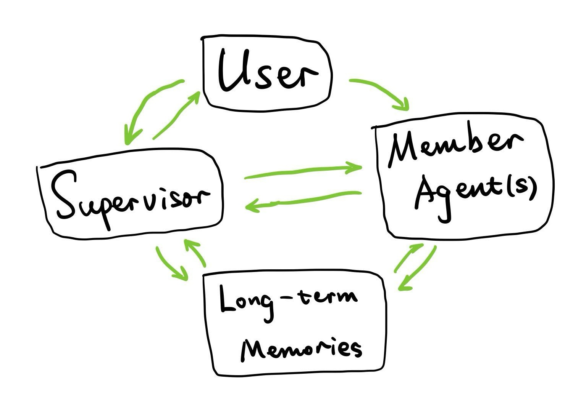

# Multi-Agent Homework System For Homework Completion

> This project is actively under development. Feel free to contribute!

A multi-agent system for homework completion, built using LangGraph.



## 🚀 Example

Here is an example of how the system works to solve a homework task. This example included most of the features that I wanted the system to have, from reading and extracting information from pdf files, to writing and executing code, forming a report and sending a notification to the user.

### Process Flow
1. The supervisor agent is given a .pdf homework file path
2. The supervisor agent asks the document agent to extract the problem and notice for lecture notes
3. Document agent checks file system and finds the lecture notes, and converts them to .md format
4. Document agent tells the supervisor agent about what it finds, and it requires both coding and math derivations
5. The supervisor agent asks the math agent to solve the math derivation
6. The math agent inspects lecture notes and homework problem, solves the math derivation, saves the solution to a .md file and notifies the supervisor agent
7. The supervisor agent asks the coder agent to write the code for the coding problem
8. The coder agent inspects lecture notes, homework problem, and math derivation, writes the code, use terminal to run the code, and modifies the report file
9. Human interrupted, as coder agent forgot to include the generated plot in the report file
10. Coder agent attaches the plot to the report file, and reports back to the supervisor agent
11. Supervisor agent decides to finish
12. Memory updater agent updates the memory, records this interaction, and remembers that they should always include the plot in the solution file

> **Note**: Refer to `TheoreticalStatistics` folder for the example files, and `TheoreticalStatistics-finished` folder for the files generated during the process. Check `raw.log` for the raw log of the process (sensitive information removed).

## ✨ Key Features

### 🤝 Multi-Agent Coordination
A *Supervisor Agent* orchestrates multiple specialized agents—*Math Agent*, *Coder Agent*, *Browser Agent*, *Document Agent*, *Communication Agent*—to finish your homework (or any other potential tasks you may find).

### 🔧 Robust Tool Integration & Extensibility
- Each agent has access to a variety of tools (e.g. file I/O, OCR, browser manipulation, terminal operations, messaging, etc.)
- New tools and agents can be quickly plugged into the framework
- Clean separation between agent logic and tool implementation
- Modular design enables rapid development and experimentation

### 🧠 Persistent Memory & Learning
- Pinecone-based vector store allows agents to store and retrieve relevant memory across sessions
- Memory updater agent continuously processes conversations to extract:
  - User preferences and constraints
  - Task-specific knowledge and solutions
  - Interaction history and outcomes
- Learned information improves future decision-making and personalization

### ⚡ Robust Error Handling
- Graceful handling of common API issues:
  - Rate limits
  - Server internal errors
  - Network connectivity problems
- Automatic retries with exponential backoff
- Detailed error logging for debugging
- System remains operational even when individual tools/agents fail

### 👥 Dual-Mode Human Intervention
#### Proactive Human Intervention:
- Interrupt and guide agents at any point during execution
- Provide additional context or corrections
- Override agent decisions when needed
- Human feedback is incorporated into memory for future improvement

#### Agent-Initiated Assistance:
- Agents can request human help via Communication Agent
- Automatic escalation for uncertain decisions
- Structured feedback collection for continuous improvement

## 🏗️ Core Architecture

### 1. Supervisor Agent
Main coordinator that decomposes the user's request into sub-tasks and delegates them to specialized member agents.

### 2. Specialized Agents
- **Math Agent**: Handles mathematical questions, outputs LaTeX-formatted solutions
- **Coder Agent**: Manages reading/writing code-related files and running Python scripts
- **Browser Agent**: Automates browser interactions like opening pages, clicking, typing, and scrolling
- **Communication Agent**: Sends emails or WeChat messages to external users
- **Document Agent**: Reads and writes different file types, or converts them (e.g., PDF to Markdown)

### 3. Tooling
Each agent interacts with the external environment via specialized tools (file I/O, OCR, browser automation, email, terminal, etc.). This design cleanly separates the logic from the side-effects, simplifying maintenance and updates.

## 🚦 Quickstart

> Developed and tested on Windows 11 only.

### 1. Install Dependencies
```bash
conda create -n hwagent python=3.12 -y
conda activate hwagent
pip install -r requirements.txt
```
**Requirements:**
- **Outlook** for the communication agent to send emails
- **Chrome** for the browser agent to open webpages

### 2. Set Environment Variables
You will need to supply API credentials for some functionalities used by this project. Please read the official documentation of each provider to obtain credentials.

**Required APIs:**
- **Pinecone**: For long-term memory
- **Gemini**: **FREE** API key for LLM calling
- **Anthropic**: For LLM calling (supervisor agent and member agent default model)
- **DeepSeek**: For LLM calling (math agent)
- **OpenAI**: For LLM calling, converting pdf to markdown (`pdf2md.py`)
- **Azure**: For OCR (browser agent)
- [Optional] **LangSmith**: For better tracing and monitoring. Check this [link](https://docs.smith.langchain.com/old/tracing/quick_start) for more details.

<details>
<summary>💡 New to LLM APIs?</summary>

If you're new to LLM APIs and want to avoid paid services, you can use Google's Gemini API which offers a generous free tier. Simply:
1. Visit [Google AI Studio](https://makersuite.google.com/app/apikey)
2. Create a free API key
3. Configure the model in `config.yaml` to use Gemini
4. Set only the `GEMINI_API_KEY` in your `.env` file
</details>

### 3. Configure the features
Edit the `config.yaml` file to enable or disable the features you want to use.

**Configuration options:**
- memory:
  - enable_retrieval: Whether the agent can retrieve memories from the long-term memory
  - enable_updater: Whether the memory updater agent runs to manipulate the long-term memory
  - enable_pinecone_update: Whether to update the long-term memory in Pinecone
- email:
  - draft_mode: Whether to really send an email, or just draft it
  - user_email: The email address of the user

The `example_config.yaml` provides a template with all LLM models set to use Gemini's free API by default.

### 4. Run an Example
**Testing single agent:**
```bash
python main_single.py
```
This invokes the Coder Agent to solve a simple coding question, serving as a minimal demonstration.

**Testing multi-agent system:**
```bash
python main.py
```
> Try the task "finish the homework TheoreticalStatistics\homework3_q2.pdf" to test it.

## 📄 License

This project is licensed under the [MIT License](./LICENSE). Feel free to explore, extend, or build upon it. If you have any questions or contributions, please consider opening an issue or creating a pull request.

## ⚠️ Current Limitations & Best Practices

### Limitations
1. LLM often misinterprets complex instructions
2. LLM hallucinates very easily
3. LLM relies on the memory context heavily

### Best Practices for Usage
1. Begin with simple, well-defined tasks
2. Allow system to build memory context
3. Monitor and correct agent behavior early and intensively!