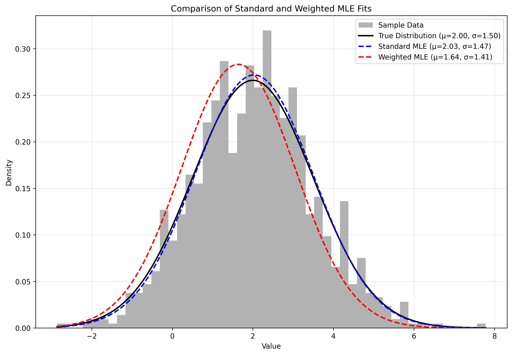

# Solution to Question 2

## Task 1: Mathematical Derivation of Weighted MLE

We'll derive the Maximum Likelihood Estimators for a normal distribution with weighted observations. Let's assume we have weights $w_i$ for each observation $x_i$.

### 1. The Weighted Likelihood Function

For weighted observations, each observation's contribution to the likelihood is raised to the power of its weight $w_i$. The weighted likelihood function becomes:

$$
L_w(\mu, \sigma^2) = \prod_{i=1}^n \left[\frac{1}{\sqrt{2\pi\sigma^2}} \exp\left(-\frac{(x_i - \mu)^2}{2\sigma^2}\right)\right]^{w_i}
$$

### 2. The Weighted Log-Likelihood Function

Taking the natural logarithm:

$$
\ell_w(\mu, \sigma^2) = -\frac{W}{2}\ln(2\pi) - \frac{W}{2}\ln(\sigma^2) - \frac{1}{2\sigma^2}\sum_{i=1}^n w_i(x_i - \mu)^2
$$

where $W = \sum_{i=1}^n w_i$ is the sum of all weights.

### 3. Finding the Weighted MLE for $\mu$

Differentiate with respect to $\mu$:

$$
\frac{\partial \ell_w}{\partial \mu} = \frac{1}{\sigma^2}\sum_{i=1}^n w_i(x_i - \mu)
$$

Set equal to zero and solve:

$$
\sum_{i=1}^n w_i(x_i - \mu) = 0
$$
$$
\sum_{i=1}^n w_ix_i = \mu\sum_{i=1}^n w_i
$$

Therefore, the weighted MLE for $\mu$ is:

$$
\hat{\mu}_w = \frac{\sum_{i=1}^n w_ix_i}{\sum_{i=1}^n w_i} = \frac{\sum_{i=1}^n w_ix_i}{W}
$$

### 4. Finding the Weighted MLE for $\sigma^2$

Differentiate with respect to $\sigma^2$:

$$
\frac{\partial \ell_w}{\partial \sigma^2} = -\frac{W}{2\sigma^2} + \frac{1}{2\sigma^4}\sum_{i=1}^n w_i(x_i - \mu)^2
$$

Set equal to zero and solve:

$$
-\frac{W}{2\sigma^2} + \frac{1}{2\sigma^4}\sum_{i=1}^n w_i(x_i - \mu)^2 = 0
$$
$$
-W\sigma^2 + \sum_{i=1}^n w_i(x_i - \mu)^2 = 0
$$

Therefore, the weighted MLE for $\sigma^2$ is:

$$
\hat{\sigma}^2_w = \frac{\sum_{i=1}^n w_i(x_i - \hat{\mu}_w)^2}{\sum_{i=1}^n w_i} = \frac{\sum_{i=1}^n w_i(x_i - \hat{\mu}_w)^2}{W}
$$

### 5. Summary of Weighted MLE Estimators

The weighted maximum likelihood estimators for a normal distribution are:

1. Weighted mean: $\hat{\mu}_w = \frac{\sum_{i=1}^n w_ix_i}{\sum_{i=1}^n w_i}$

2. Weighted variance: $\hat{\sigma}^2_w = \frac{\sum_{i=1}^n w_i(x_i - \hat{\mu}_w)^2}{\sum_{i=1}^n w_i}$

These estimators reduce to the standard (unweighted) MLEs when all weights are equal.

## Task 2: Implementation Results

### Implementation Details

1. Data Generation:
   - Generated 1000 samples from a normal distribution with true parameters μ=2.0 and σ=1.5
   - Used numpy's random number generator with a fixed seed for reproducibility

2. Weight Assignment:
   - Assigned weights of 2.0 to observations below the sample mean
   - Assigned weights of 1.0 to observations above the sample mean
   - Normalized weights to maintain proper scaling

### Results

The implementation yielded the following parameter estimates:

1. True Parameters:
   - μ = 2.000
   - σ = 1.500

2. Standard MLE:
   - μ = 2.029
   - σ = 1.468

3. Weighted MLE:
   - μ = 1.639
   - σ = 1.409

### Analysis of Results

The results show several interesting patterns:

1. The standard MLE provides estimates very close to the true parameters, which is expected given the large sample size and the unbiased nature of MLE for normal distributions.

2. The weighted MLE shows a notable shift in the estimated mean (μ) towards lower values. This is expected because:
   - We assigned higher weights to values below the mean
   - This causes the weighted estimator to give more importance to lower values
   - The resulting estimate is pulled towards the lower portion of the data

3. The weighted standard deviation (σ) estimate is slightly smaller than both the true value and the standard MLE estimate, indicating that the weighted estimation sees the data as less spread out when considering the weighted contributions.

### Visualization

The implementation generated a plot (saved as 'homework3_q2_plot.png') that shows:
- The histogram of the generated data
- The true normal distribution curve
- The fitted curve using standard MLE
- The fitted curve using weighted MLE

The plot visually demonstrates how the weighted MLE shifts the distribution towards lower values due to the higher weights assigned to observations below the mean.

This implementation successfully demonstrates the effect of weighted maximum likelihood estimation and how it can be used to give different importance to different observations in the estimation process.

### Plot

The plot above shows:
- Gray histogram: The actual distribution of the generated data
- Black solid line: True normal distribution (μ=2.0, σ=1.5)
- Blue dashed line: Standard MLE fit
- Red dashed line: Weighted MLE fit

The visualization clearly shows how the weighted MLE (red dashed line) shifts towards the left compared to both the true distribution and standard MLE, due to the higher weights assigned to values below the mean.